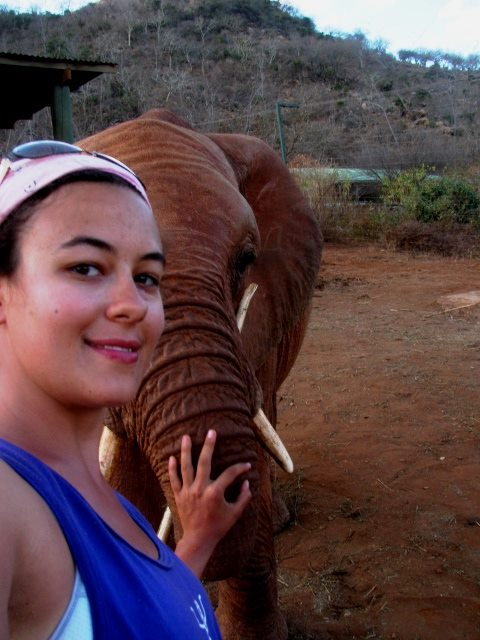
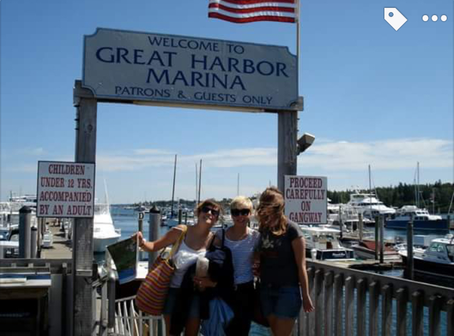
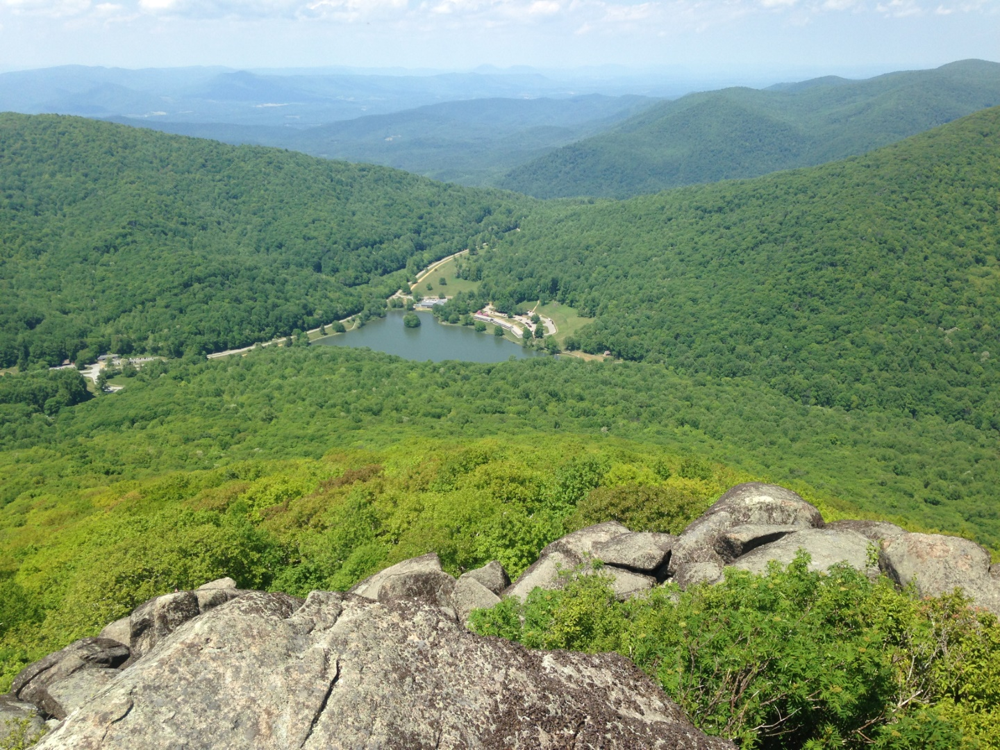
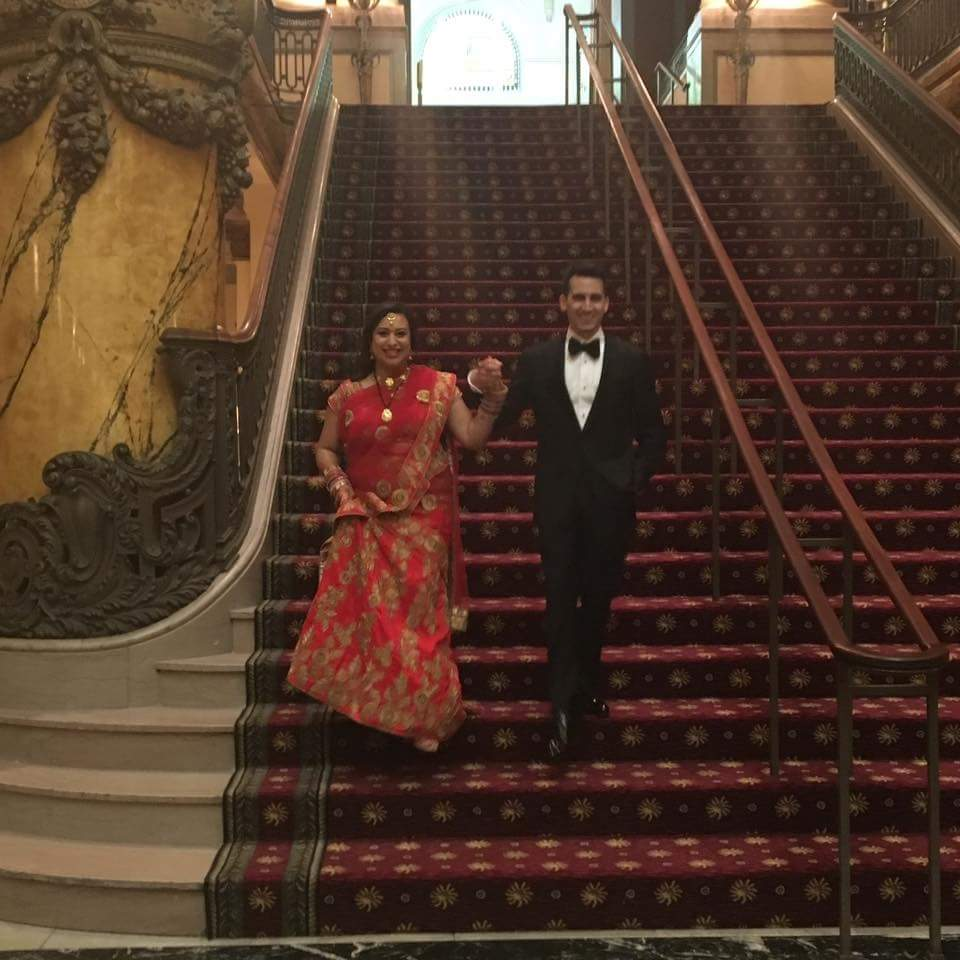
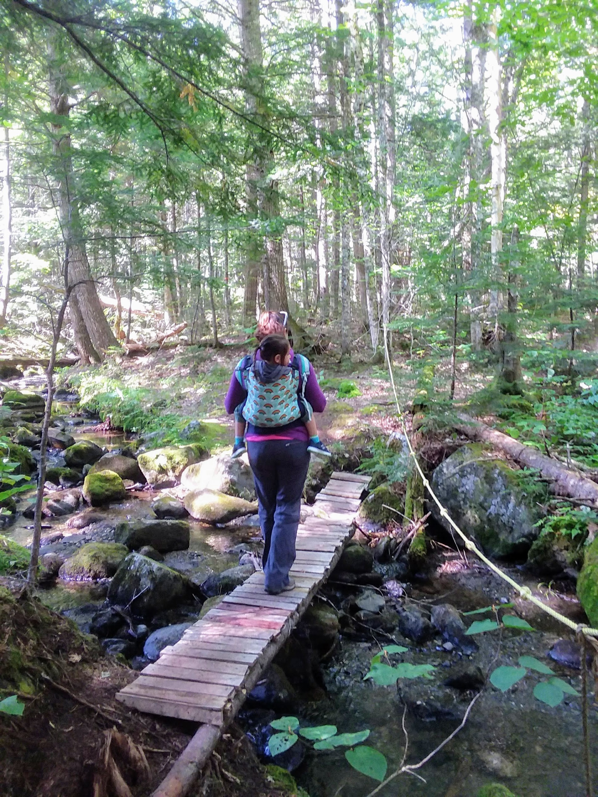
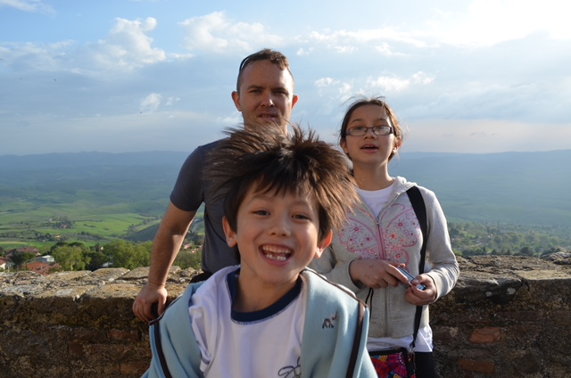
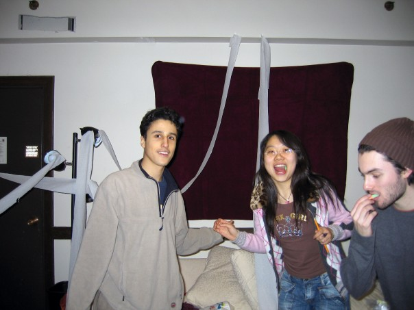
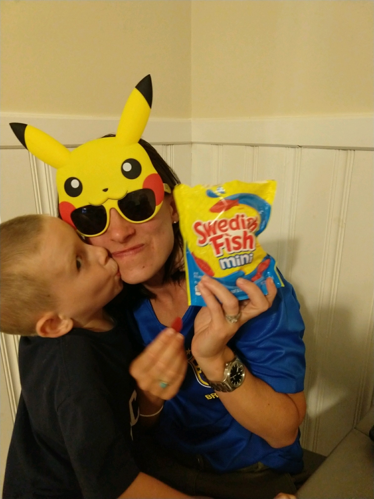
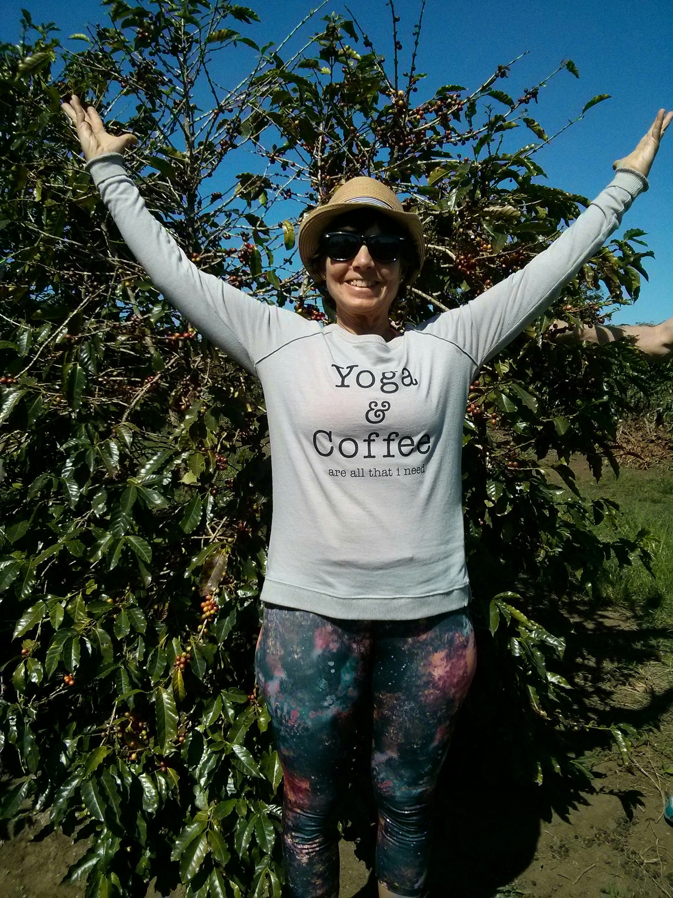
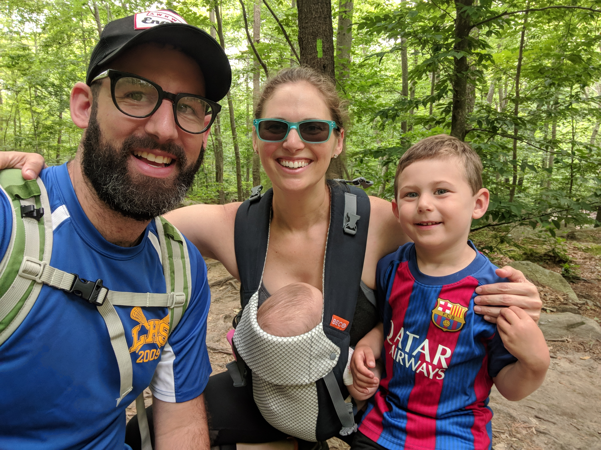

I was on my first fieldwork trip to Africa, and we got the opportunity to visit an elephant orphanage. We got to meet the baby elephants!  

---

This is a picture I took of my friends, Anna, Laney, and Gwen before we went sailing one summer day when I was home from college. The plan to go sailing was spontaneous and I had never been out with Anna and Laney, who were experienced sailors. We sailed up Somes Sound, a fijard on the island where we lived. The wind was so strong, we had to tack back and forth across the Sound. At times, we were taking so hard, that the whole boat was on its side and the sail was skimming the water. As we passed other boats, Gwen would say things like "they're all staring at us because we're a boat full of beautiful women and they are curious because we are the only ones on the water without an old guy playing captain".

---

It's really just me and one of my good friends making ridiculous poses with a crepe cake that we had made. There were rumors that we were dating so we had decided to take these real cutesy photos and try to mess with people and it just turned out so well. This was all right after finals had ended but we were still on campus and I just remember feeling so carefree and genuinely happy at that point in time.

---

Time spent in nature with a loving partner. Enjoying the beauty of the natural world with time and space to breath, relax, and step back.

---

Wonderful picture of our wedding day, as we walk into cocktail hour as newlyweds.

----

Woman and young child standing in a forest. Child is in a soft carrier on the woman's back.

---

We were living in Brussels and took holiday in Tuscany. We stayed in a beautiful villa turned hotel -- had a gorgeous views on the surrounding mountains and countryside -- and had rented a car and were visiting towns/villages in the area during the day. We had visited San Gimignano for the day -- and I remember at lunch, our kennel calling at lunch in the town square and telling us our Great Dane had shown signs of bloat and had been rushed to the vet. It was terrifying to hear -- but at the same time, funny since we couldn't understand the vet because of his accent and wondered how our dog had "hair" in her stomach -- and then we realized it was, in fact, air. The vets were acting quickly to try to reverse the bloat -- and I remember my two young children getting very upset and trying to cheer them up with gelato for dessert. We wandered through the town, worried for the dog (but getting good updates from the vet) and we stopped to take photos along the town's wall and my son decided to photo bomb this picture which made us all laugh despite the ups and downs of the day. One of my favorite photos that always makes me laugh and smile and remember what was, overall, a wonderful family holiday.

---

We picked out a computer, went to Best Buy, and walked out with three. I was so excited because we were finally getting gaming PCs

---

I'm in my freshman room dorm, together with my roommate Andrew and our friend Vivian. Inexplicably, there is toilet paper draped around the walls as garlands, and Vivian and Andrew seem to be eating sour worms. It's right before freshman year finals, and it looks like we're blowing off steam. I've lost touch with both of them, but had grown very close to them in the years that followed at Princeton.

---

It's my 33rd birthdays. I don't like birthdays. I'm not sure if it's the attention and being uncomfortable with being the center of others attention for a day or what. I like being sufficient for myself and gifts, while welcomed, also make me uncomfortable. I don't like telling people what I want. My son is kissing me because he gave me some random Pokemon Pikachu sunglasses that take up half my face. My kids are showing me that they love me. They bought me swedish fish, my favorite candy when and if I eat candy. I wear a world cup brasil journey because I love watching the world cup in the summer with my family. My son is kissing me. He loves me. It's a photo of love.

---

This photo sums it up, yoga and coffee are all I need! What could be better than being in a sunny, tranquil coffee plantation during a yoga retreat to Costa Rica in January?

---

